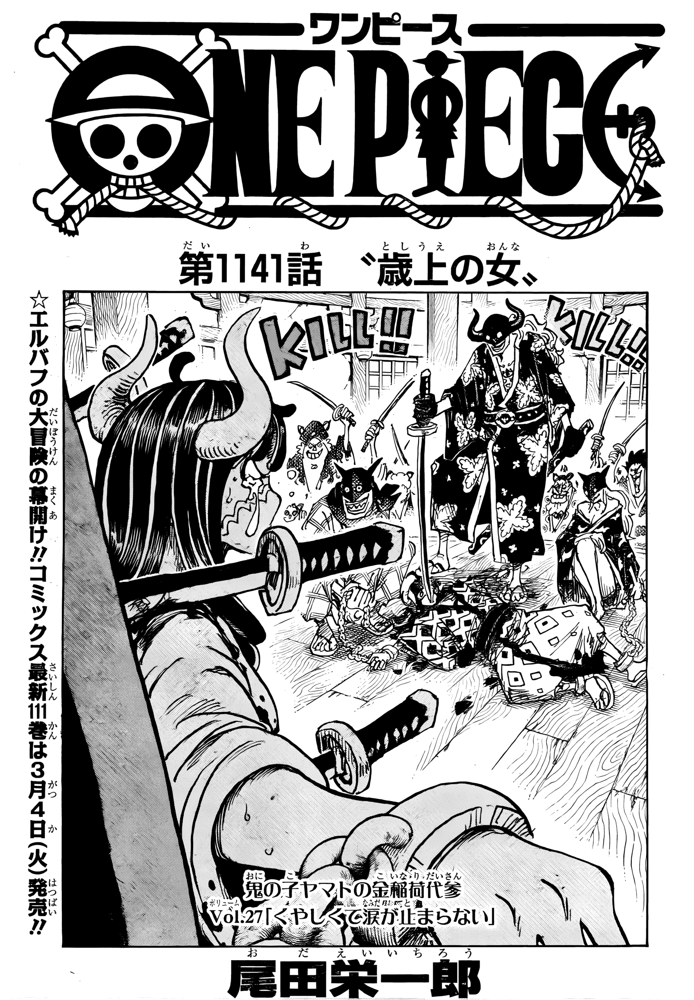
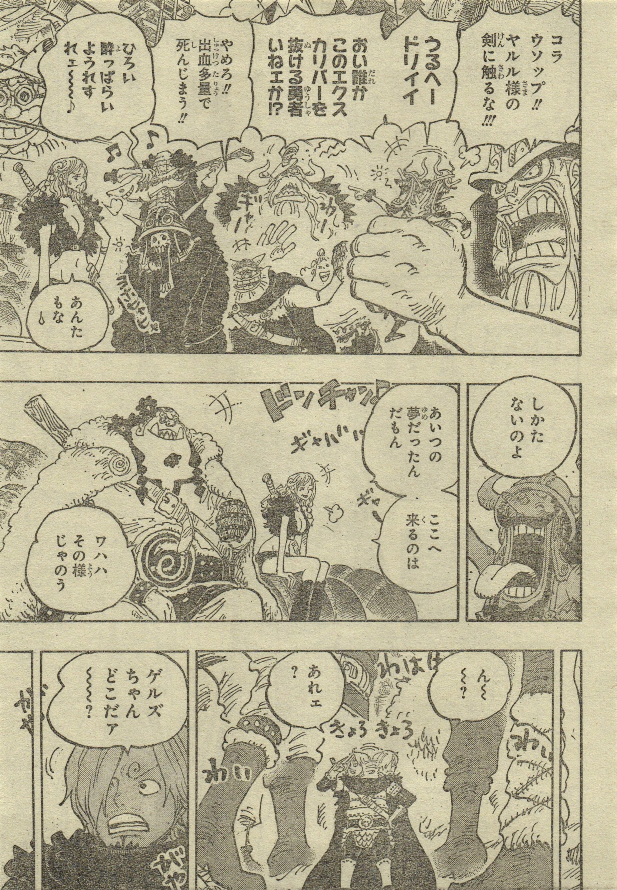
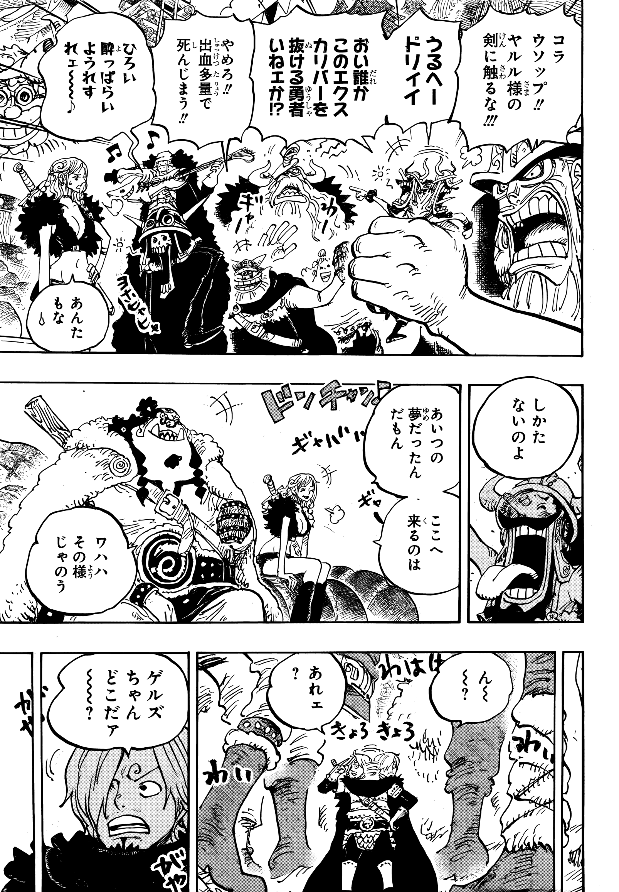
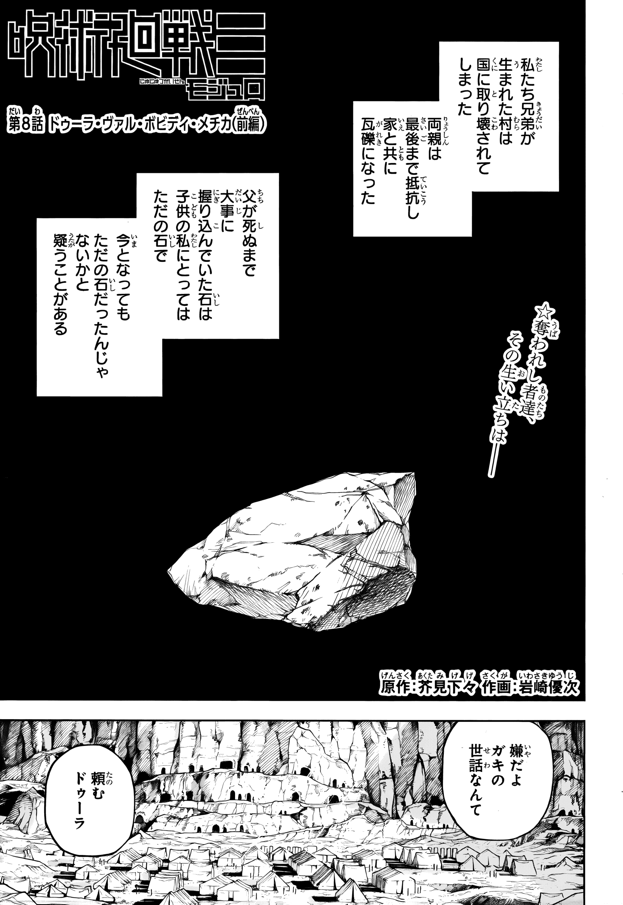
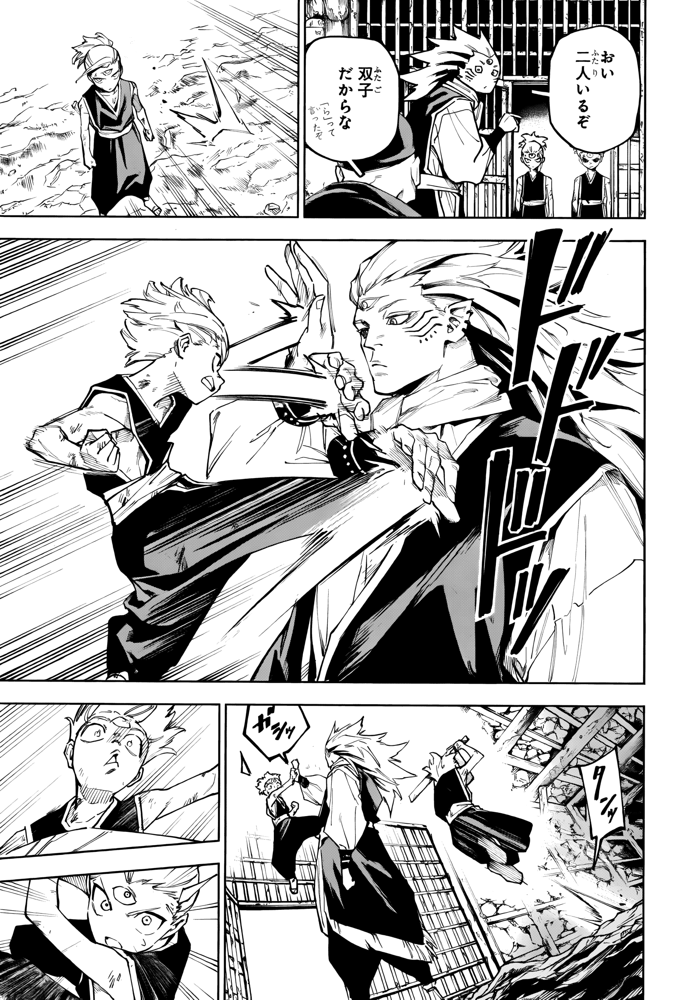

# schillyCL

> AI-powered restoration of physical Weekly Shonen Jump manga scans

schillyCL is a fine-tuned image restoration model built on Real-ESRGAN, trained to clean physical WSJ magazine scans — removing paper grain, yellowing, halftone artifacts, and restoring black ink lines to their original clarity.

---

## Examples


### Example 1
| Before | After |
|--------|-------|
|  |  |

### Example 2
| Before | After |
|--------|-------|
|  |  |

### Example 3
| Before | After |
|--------|-------|
|  |  |

### Example 4
| Before | After |
|--------|-------|
|  |  |

---

## Features

- Removes paper grain and yellowing from physical magazine scans
- Reduces halftone dot patterns while preserving fine detail
- Restores black ink lines without over-smoothing
- Tile-based inference with Gaussian blending — no visible seams
- Optional bilateral filter pre-processing and levels post-processing
- Outputs at 2200px height by default

---

## Model

schillyCL is based on RRDBNet (Real-ESRGAN architecture) fine-tuned on a dataset of matched physical WSJ scan / digital pairs spanning 20+ chapters across multiple manga titles.

Training highlights:
- Real scan/digital pairs aligned via ORB feature matching
- Custom WeightedL1Loss punishing incorrect black pixel output 3x harder than standard L1
- Scale 1 restoration — no upscaling, pure quality improvement
- Trained on RTX 3060 12GB

**Model weights are not included in this repository.**  
<!-- Add a link here when you upload weights to HuggingFace or Google Drive -->
Download weights: _coming soon_

---

## Installation

```bash
git clone https://github.com/schilly-stack/schillyCL
cd schillyCL
pip install -r requirements.txt
```

You will also need to install Real-ESRGAN and BasicSR:

```bash
pip install basicsr realesrgan
```

---

## Usage

### Basic inference

```bash
python inference.py
```

Reads from `data/test/` and outputs to `data/test_output/`.

### Inference with pre/post processing

```bash
python inference_filtered.py
```

Applies bilateral filter before the model and levels adjustment after.

### Prepare your own dataset

If you have matched scan/digital pairs:

```bash
# 1. Rename files to sequential numbers per chapter
python scripts/prepare/rename.py

# 2. Align scans to digitals and generate crops
python scripts/prepare/align_and_crop.py

# 3. Clean up unmatched crops
python scripts/prepare/cleanup_orphans.py
```

If you only have digitals and want to use synthetic degradation:

```bash
python scripts/prepare/degrade.py
```

---


## Training Your Own Model

Training requires Real-ESRGAN installed locally and a matched dataset of scan/digital pairs or synthetically degraded images.

See `scripts/prepare/` for dataset preparation tools.

Training is configured via `options/manga_finetune.yml` in your Real-ESRGAN installation.

Key training parameters used:
- Architecture: RRDBNet (num_block: 23, num_feat: 64)
- Loss: WeightedL1Loss (dark_weight: 3.0, dark_threshold: 0.3)
- Patch size: 512×512
- Optimizer: Adam (lr: 1e-4)
- Total iterations: 50,000+

---

## Acknowledgements

Built on top of [Real-ESRGAN](https://github.com/xinntao/Real-ESRGAN) by Xintao Wang et al.  
Training data sourced from Weekly Shonen Jump physical magazine scans.

---

## License

MIT License — model weights subject to separate terms when released.